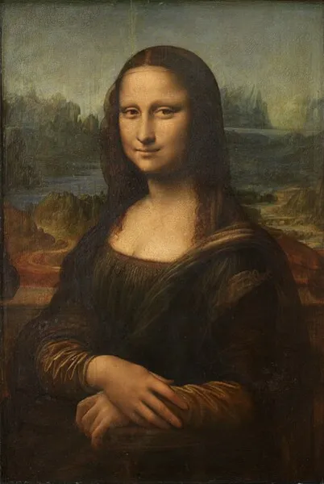

Title: O Polímata Leonardo da Vinci
Date: 2025-08-15
Category: Geral
Tags: arte, textos
Slug: polimata-da-vinci
Author: Wandeson Ricardo

)

# História e trajetória

Leonardo di Ser Piero da Vinci nasceu em 15 de abril de 1452, na vila de Vinci, próxima a Florença, filho ilegítimo de um notário e de uma camponesa. Desde cedo, demonstrou habilidades artísticas, ingressando como aprendiz no ateliê de Andrea del Verrocchio, onde teve contato com pintura, escultura, engenharia e mecânica. Trabalhou para mecenas influentes, como Ludovico Sforza, em Milão, e mais tarde serviu em diferentes cidades italianas. Nos últimos anos de vida, foi convidado pelo rei Francisco I para viver na França, onde permaneceu até sua morte, em 2 de maio de 1519.

# Obras e criações artísticas

A produção pictórica de Leonardo tem enorme impacto cultural. Entre as obras mais célebres estão Mona Lisa, reconhecida por sua técnica inovadora e expressão enigmática, e A Última Ceia, famosa pela composição e profundidade emocional. Produziu também desenhos icônicos como o Homem Vitruviano, que ilustra a relação ideal entre proporções humanas e geometria. Sua abordagem artística unia observação minuciosa, domínio técnico e experimentação, resultando em obras que influenciaram profundamente a arte ocidental.

# Estudos e contribuições científicas

Além de artista, Leonardo foi engenheiro, inventor, anatomista, botânico e estudioso de fenômenos naturais. Deixou cadernos repletos de anotações, diagramas e esboços que abrangem desde projetos de máquinas voadoras e armas até estudos detalhados da anatomia humana e animal. Seu método baseava-se na observação direta e no registro preciso, combinando ciência e arte em um mesmo processo criativo. Esses registros, embora muitos não tenham sido publicados em vida, revelam sua visão interdisciplinar e continuam sendo fonte de inspiração e pesquisa.

**Fontes**

1. [Wikipedia ](https://pt.wikipedia.org/wiki/Leonardo_da_Vinci)
2. [Brasil Escola UOL](https://brasilescola.uol.com.br/biografia/leonardo-vinci.htm)